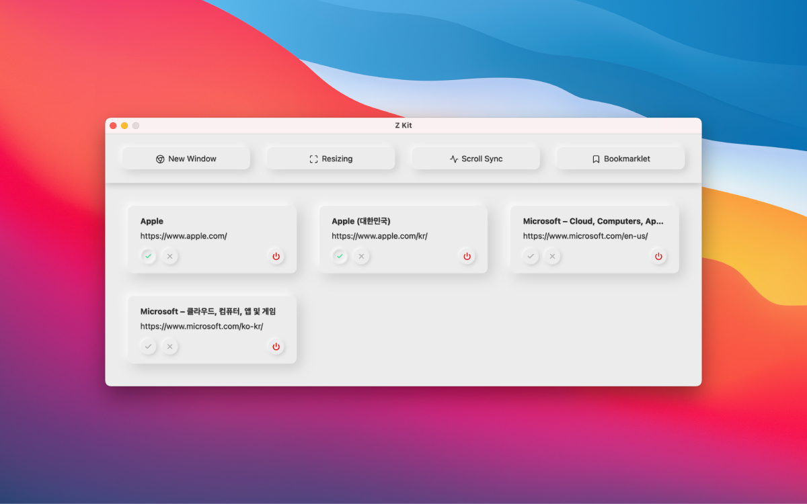

# Z Kit

Screen comparison tool for localization work 🌏

  

> This desktop application was built with [Electron].

## Features

- Create and maintain browser windows
- Resizes a window to the specified width and height
- Scroll two or more window simultaneously
- Bookmarklet

## Installation

Download latest release 👏

| Windows | macOS (Universal) | GNU/Linux (AppImage) |
| -- | -- | -- |
| [Download](https://github.com/GunnKimKR/Z-Kit/releases/latest/download/Z-Kit-Setup-1.0.0.exe) | [Download](https://github.com/GunnKimKR/Z-Kit/releases/latest/download/Z-Kit-1.0.0-universal.dmg) | [Download](https://github.com/GunnKimKR/Z-Kit/releases/latest/download/Z-Kit-1.0.0.AppImage) |

[Electron]: https://electronjs.org/
